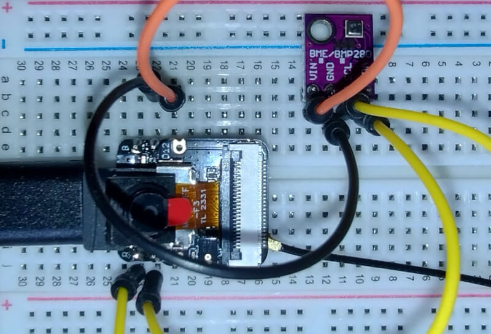
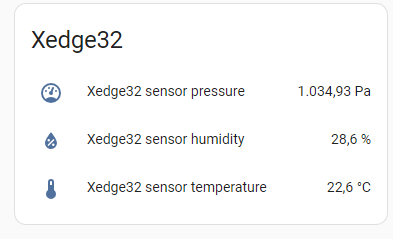

# Xedge32 Weather Station App

The ESP32 powered Weather Station App collects and manages weather data using a BME280 sensor. It interfaces with the sensor via I2C to collect temperature, humidity, and pressure data, storing this information in a local time series database. In addition, the application supports a plugin architecture with the following supported plugins:

1. [Home Assistant](https://www.home-assistant.io/)



## Features

* BME280 Sensor Integration: Collects weather data like temperature, humidity, and pressure.
* Time Series Database: Manages and stores weather data over time.
* Regular Data Collection: A timer function that collects data every two seconds with intelligent data filtering.
* Email Notifications: Optionally sends updates and error messages via email.
* Error Handling: Handling for sensor and data processing issues.

## When SD card enabled
* Data Collection: The app automatically collects data from the BME280 sensor and stores it in the time series database
* Accessing Data: Access the collected data via the time series database for analysis and reporting

## File Description

* `.preload`: Initializes the BME280 sensor and sets up the timer function for data collection. See the [Xedge documentation: Xedge Applications](https://realtimelogic.com/ba/doc/?url=Xedge.html#apps) for .preload script details.
* `.lua/tsdb.lua`: Manages the time series database, including data saving, reading, and removing old files.
* `.lua/HomeAssistant.lua`: Optional Home Assistant plugin.
* `getwd.lsp` : REST service used by index.html
* `index.html` : Example code for fetching TS data

## Parts Required

1. ESP32 with PSRAM or the newer ESP32s3. The ESP32 should preferably include an SD card slot, such as the [S3-N16R8](https://www.aliexpress.us/item/3256806014820995.html). Most CAM boards, such as [this one](https://www.aliexpress.us/item/3256804601970891.html), come with an SD card slot.
2. Firmware: Upload the [Xedge32 firmware](https://realtimelogic.com/downloads/bas/ESP32/) onto the ESP32.
2. [BME280 Module](https://www.aliexpress.us/item/3256805781410598.html).
3. [Breadboard](https://www.aliexpress.us/item/3256805916002941.html).
4. [Male to Male Jumper Wire](https://www.aliexpress.us/item/2251832664201754.html).

### Parts Setup

1. Sensor Setup: Connect the BME280 sensor to your ESP32 via the I2C interface.
   1. Wire the ESP32's GPIO pin 1 to the BME280 sensor's SDA.
   2. Wire the ESP32's GPIO pin 2 to the BME280 sensor's SCL
   3. Wire the ESP32's 3.3V out pin to the BME280 sensor's VCC; You may also be able to use the 5V depending on the BME280 sensor board you are using.
   4. Wire the ESP32's GND pin to the BME280 sensor's GND.

**Note:** you may use different GPIO pins but must update the [.preload](src/.preload) script accordingly. See the top of the .preload script for details. For additional details on wiring the ESP32 and the BME280 sensor, see the initial part of [this tutorial](https://lastminuteengineers.com/bme280-esp32-weather-station/), but stop when you get to the Arduino IDE.
 
2. Xedge32 configuration: Make sure Xedge32 operates in [Station Mode](https://realtimelogic.com/ba/ESP32/source/AccessPointMode.html#switching-to-station-mode).
3. SD Card configuration: See the first part of the tutorial [ESP32 WebDAV Server](https://realtimelogic.com/articles/ESP32-WebDAV-Server) for how to enable the SD card; the application works without an SD card, but the Time Series Database will be disabled.
2. Upload the Weather Station App: Upload the code in the src directory to a new directory, such as 'WeatherStation', using the WebDAV plugin. See [this video](https://youtu.be/i5ubScGwUOc?si=zUw-Q0NQ6UYG4rUe) if you are new to WebDAV.
   1. When Xedge32 is switched on and operating in Station Mode, mount the following directory as a WebDAV network drive: http://xedge32.local/rtl/apps/disk/
   3. In the mounted drive, create the directory 'WeatherStation'.
   2. Using the mounted WebDAV network drive, copy all of the source code in the 'src/*' directory, including subdirectories, to the http://xedge32.local/rtl/apps/disk/WeatherStation/ directory. Do not include the 'src' directory; in other words, the .preload file should be located at http://xedge32.local/rtl/apps/disk/WeatherStation/.preload after completing the upload.
3. Copy the configuration file WeatherStationConfig.json to http://xedge32.local/rtl/apps/disk/.

4. In the Xedge32 IDE (http://xedge32.local/rtl/), expand 'disk' in the left pane, right-click the 'WeatherStation' directory, and select 'New App'. In the 'Application Configuration' dialog:
   1. Check the 'Start App' and 'LSP App' options.
   2. Leave the Directory Name blank.
   3. Click the Save button.

5. The application should start and find your BME280 sensor if the wiring is correct. Note that you will see some printouts such as "dropping msg for ...". You see these messages when a browser is not connected to the Weather App UI.

## Configuring the Home Assistant Plugin

You may enable the Home Assistant Plugin if you have enabled your [Home Assistant MQTT Broker](https://www.home-assistant.io/integrations/mqtt/).

1. Add the following to your [Home Assistant configuration.yaml file](https://www.home-assistant.io/docs/configuration/):

```
mqtt:
  sensor:
    - name: "Xedge32 sensor temperature"
      unique_id: "xedge32_sensor_temperature"
      state_topic: "/office/sensor1"
      value_template: "{{value_json.temperature}}"
      device_class: "temperature"
      unit_of_measurement: "°C"
    - name: "Xedge32 sensor humidity"
      unique_id: "xedge32_sensor_humidity"
      state_topic: "/office/sensor1"
      value_template: "{{value_json.humidity}}"
      device_class: "humidity"
      unit_of_measurement: "%"
    - name: "Xedge32 sensor pressure"
      unique_id: "xedge32_sensor_pressure"
      state_topic: "/office/sensor1"
      value_template: "{{value_json.pressure}}"
      device_class: "pressure"
      unit_of_measurement: "Pa"
```

**Important:** the above configuration file, including the MQTT topic, must match the settings in [WeatherStationConfig.json](WeatherStationConfig.json)

2.  Restart Home Assistant or reload the configuration.

3. Add a suitable entity card to the HA dashboard, and then add the following entities:
```
Xedge32 sensor temperature
Xedge32 sensor humidity
Xedge32 sensor pressure
```



4. In the Xedge32 IDE, expand 'disk' and click WeatherStationConfig.json. Ignore the warning.
5. Set the enable flag to true, set the broker's IP address, and the broker's username and password.
6. Restart the WeatherStation app.

## Contributing

We welcome contributions! Please fork the repository and submit a pull request if you have suggestions or improvements. The code is currently missing the HTML UI, which should preferably be designed as a SPA. You can navigate to http://xedge32.local/ (the root) after starting the WeatherStation app. You should see a basic HTML UI designed for test purposes.
